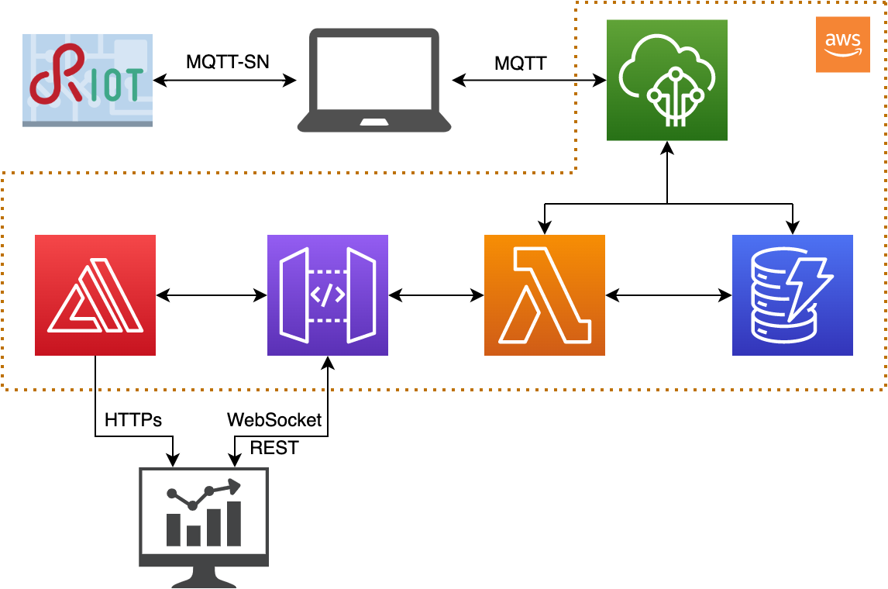
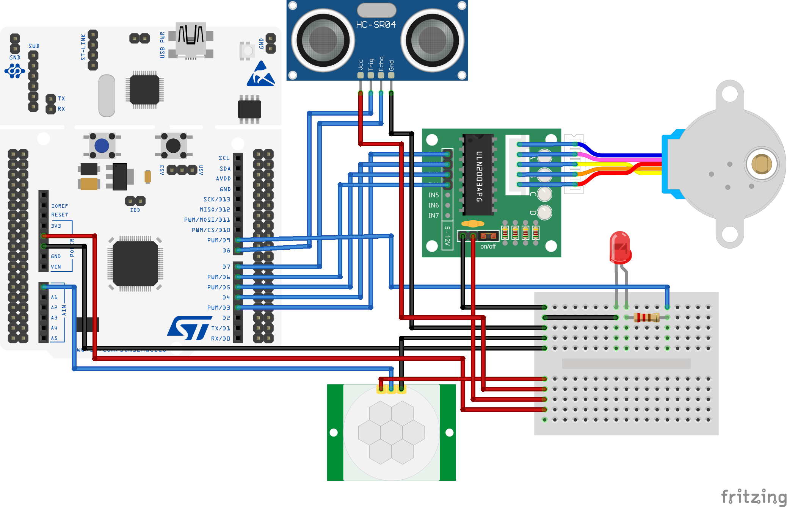

# Pet Feeder
*Individual project for the IoT course 2022 at La Sapienza University of Rome*

The project was born from the need to feed my pet automatically or manually from remote places. To solve that problem I created a cloud-based IoT system that collects information from sensors and interacts with the environment using actuators.

## Architecture
The IoT device is developed using RIOT-OS and a STM NUCLEO-f401re board. The cloud-based services are based on the AWS ecosystem.
The system is composed by two sensors and two actuators:
- Ultrasonic sensor (HC SR04): measures the fill level of the dispenser. It is put on top of the food container and measures the distance from the food. While it is dispensed, the level goes down and the ultrasonic measures bigger distances.
After it has been activated, this sensor returns an echo back whose pulse width (uS) is proportional to the distance measured. This value can be divided by 58 to obtain the distance in cm. The resolution is 0.3cm and the minimum distance that can be measured is 2cm. For that reason, the sensor was placed 2cm above the maximum fill level of the food container.
When the container is empty the sensor is going to measure the distance from the screw. This distance will depend on the current rotation position of the screw, so values bigger than the threshold (5.69cm - 330uS) will be considered as empty level. The container will be considered filled when the sensor measures a distance equal to 2.59cm (150uS).
- PIR motion sensor (HC SR501): check if the pet is walking past the food dispenser. This sensor is always on. When it detects movements inside the range of a 110° angle and 5m distance, a 3.3V impulse of 3 seconds is sent to the analog pin. Every second the value emitted by the sensor is read from the board and if it is high (it has detected movements) it triggers the stepper motor.
- Stepper motor (28BYJ 48 + ULN 2003 driver): rotates a screw which dispenses the food.
- Led: lights on when the food container is empty.

The board is connected through MQTT-SN to an RSMB broker hosted on the machine the board is connected to. The connection is carried out using IPv6 and RIOT-OS tap interfaces. The board publishes on “topic_out” and subscribes to “topic_in” to receive messages from outside.

A transparent bridge written in python is used to forward messages to and from AWS IoTCore. It runs on the machine the board is connected to. It reads messages from the local broker with “topic_out” and publishes them to AWS IoTCore on the same topic. It also reads messages from AWS IoTCore with “topic_in” and publishes them on the local broker with the same topic.

Once data arrives to AWS IoTCore the computation proceeds on the AWS cloud using the following services: DynamoDB, Lambda, API Gateway, Amplify.

## Network
In the network there will be transmitted only the fill level coming from the board and the dispense message going to the board. These messages are less than 25 bytes, so even a narrow band will be suitable for our use. Low latency is required to deliver the dispense message, as the user expects its action of clicking the button on the web dashboard to be executed in the range of 1 to 5 seconds.
- The average measured latency of the system from the moment in which the ultrasonic sensor is asked to read the fill level to the point in which the result is integrated in the dashboard is less than 2 seconds. That is also because of the time the browser takes to update after it receives a message from the WebSocket.
- The average measured latency of the system from the moment in which the user requests a dispense from the dashboard to the point in which the stepper motor actually dispenses food is less than 1 second.
- The average round trip time from the moment in which the user requests a dispense from the dashboard to the point in which the new fill level is integrated in the dashboard is less than 5 seconds. That is because the fill level is measured after the dispenser has finished dispensing food and this process takes up to 2 seconds.

These latencies are short enough to not affect the usability of the system and are compliant with the objectives set before the development.

Data is transmitted every time the user asks to dispense food and every time food is dispensed (to store the fill level in the cloud). In the first case the message will have a fixed length of 22 bytes. In the second case the message will have a fixed length of 17 bytes. Clearly there will be overhead due to headers necessary to transmit the messages. MQTT-SN was chosen as the protocol to transmit messages because of its characteristics suitable for IoT applications, in particular for its small overhead.

## Logic
This IoT system follows the 'Sense-Think-Act' paradigm.

When the PIR motion sensor detects a pet walking past the dispenser it sends an impulse to an analog pin which is read every second. When the impulse is detected a callback function is called and the stepper motor is activated to do 2000 steps and dispense food. A timer is set to disable the stepper for a certain amount of time and avoid it dispensing food every time the pet walks past. The user can also dispense food from remotely using a web dashboard.

After having dispensed food, the ultrasonic sensor is activated to measure the fill level of the food container. If the value is over a threshold the led is switched on to report that it needs to be filled. If the led is on but the container has been filled, it is switched off.

The application collects and stores only the fill level coming from the ultrasonic sensor. This happens after every time food is dispensed, both if as a consequence of motion detection or if the user has manually dispensed it. These data are then stored in AWS DynamoDB to be included in the web dashboard.

The computation linked to sensors and actuators is carried on entirely on the board. This choice was made because the board could provide the required computational power and it avoided higher latencies to send data to the cloud and retrieve the instructions to be performed. This choice also reduced the number of messages exchanged over the network and the cloud usage.

The cloud only manages the communications with the user via the web dashboard. The following AWS services were used:

DynamoDB:
- table: connections; partition key: conn_id (String).
- table: pet_feeder; partition key: id_time (Number); column: fill_level (String).

API Gateway:
- name: update_level; protocol: WebSocket; routes: connect (linked to lambda function websocket_connect.py) and disconnect (linked to lambda function websocket_disconnect.py).
- name: petfeeder_api; protocol: REST; resources: GET (linked to lambda function read_level_from_db.py) and POST (linked to lambda function publish_dispense_to_iotcore.py).

AWS Amplify:
- Code inside WebApp folder.

IoTCore:
- rule: perfeeder_store; rule query statement: SELECT message FROM 'topic_out'; actions:
Insert a message into a DynamoDB table (partition key value: ${timestamp()}; write message data to this column: fill_level) and
Send a message to a lambda function (send_to_websocket.py).
- messages format: topic_in {“message” : “dispense”}; topic_out {“message” : “%value”} where %value is an integer.

Lambda functions:
- publish_dispense_to_iotcore: publishes the dispense message to topic_in.
- read_level_from_db: returns the elements from DynamoDB table “pet_feeder” whose id_time is not older than one hour before when it is called.
- send_to_websocket: sends the new value to all active WebSocket connections.
- websocket_connect: stores in DynamoDB table “connections” the connection id in input.
- websocket_disconnect: deletes from DynamoDB table “connections” the connection id in input.

Policies were set up using AWS IAM (Identity and Access Management) to ensure proper communication between the above services.

## How to setup and run the system

1. Configure the AWS cloud system:
- Lambda. Create five lambda functions in python using the code provided in the folder LambdaFunctions. The functions are: publish_dispense_to_iotcore, read_level_from_db, send_to_websocket, websocket_connect, websocket_disconnect.
- DynamoDB. Create two tables: connections (with partition key “conn_id” of type String) and pet_feeder (with partition key “id_time” of type Number).
- IoTCore. Create a new Thing. Then set up a new rule using the selector “SELECT message FROM 'topic_out'” and two actions: insert message in DynamoDB table (with partition key value “${timestamp()}” and write message data to the column “fill_level”) and sends a message to the lambda function “send_to_websocket.py”.
- API Gateway. Create a REST API with resources GET (linked to lambda function read_level_from_db.py) and POST (linked to lambda function publish_dispense_to_iotcore.py). Create a WebSocket API with routes “connect” (linked to lambda function websocket_connect.py) and “disconnect” (linked to lambda function websocket_disconnect.py). Inside the lambda function send_to_websocket.py update the endpoint url with the one provided by the API gateway.
- Amplify. Create a new app and upload the code provided in the WebApp folder. In the file index.js update the API endpoints into the functions webSocketLaunch, dispense and callApi.
- IAM. Set up all the policies needed to allow the services to communicate between them.

2. Connect all the sensors and actuators to the board using the following schema:

3. Clone the [mosquitto.rsmb repository](https://github.com/eclipse/mosquitto.rsmb.git) to your machine, go inside the folder mosquitto.rsmb/rsmb/src and compile the code using the command “make”. In the folder mosquitto.rsmb/rsmb create a file called config.conf and paste inside it the following code:
`listener 1885 INADDR_ANY mqtts \n ipv6 true \n listener 1886 INADDR_ANY \n ipv6 true`.
In the folder mosquitto.rsmb/rsmb launch the command “./src/broker_mqtts config.conf” to open the local MQTT broker.

4. Inside the file transparent_bridge.py configure the following parameters: host, rootCAPath, certificatePath, privateKeyPath. You should download the necessary files from AWS IotCore. Launch the transparent bridge using the command “python3 transparent_bridge.py”.

5. Clone the [RIOT repository](https://github.com/RIOT-OS/RIOT.git) to your machine and put it inside our RiotCode folder. You can adjust the time between automatic dispensing by modifying the defined value of `INTERVAL` in the file “main.c”. Then connect the board to the machine and launch the command “make flash” to compile the code and upload it to the MCU. On the machine launch the command "sudo ip a a 2000:2::1 dev tap0". Restart the board through the reset button.

6. Open the Web App at the link provided by AWS Amplify and use the system!

## Miscellaneous
Some 3D models for printed parts were taken from the following links:
- https://www.thingiverse.com/thing:14452
- https://www.thingiverse.com/thing:548975
- https://www.thingiverse.com/thing:3051036

Two accessories were designed specifically for this project. All 3D models can be found in the 3D folder.

[Here](https://www.youtube.com/) is the video of a demonstration of the final system.

[Here](https://www.hackster.io/) is a step-by-step tutorial.

[Here](https://www.hackster.io/) is a blog post related to this project.

[Here](https://iot.andrearodriguez.it) is the dashboard.
